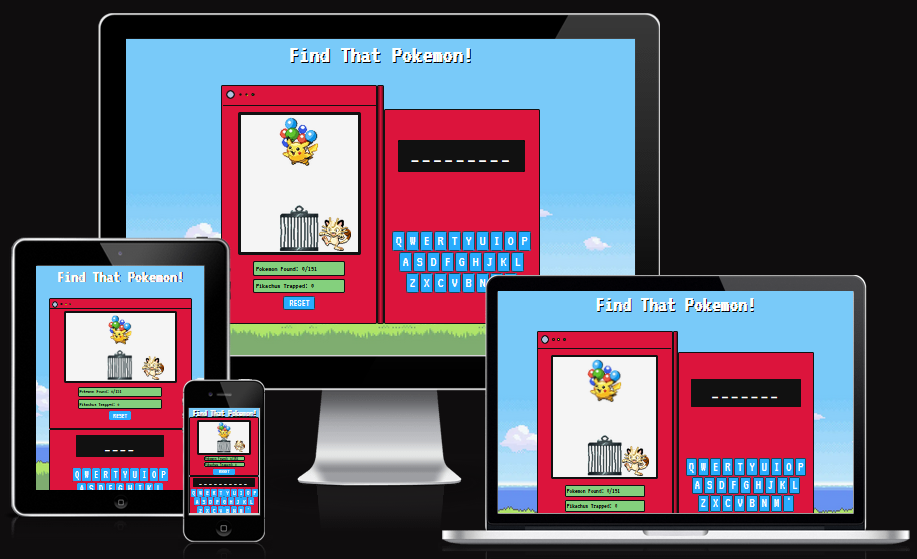
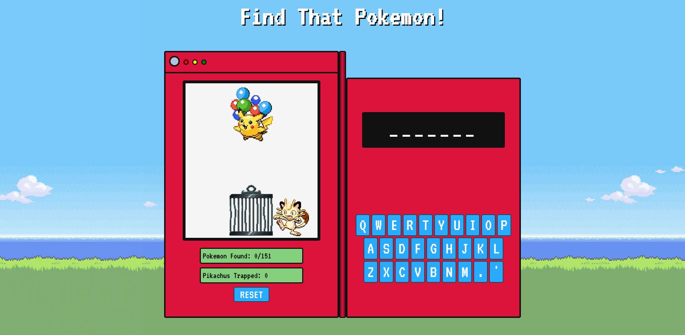
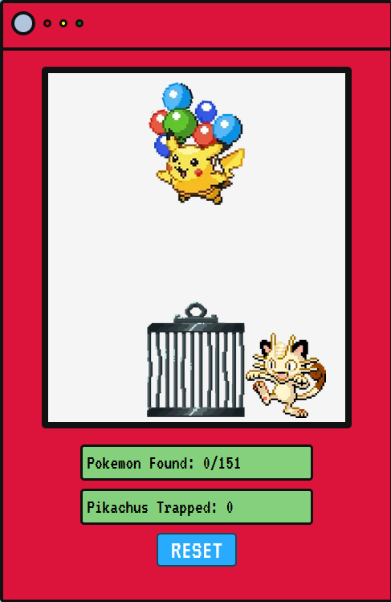
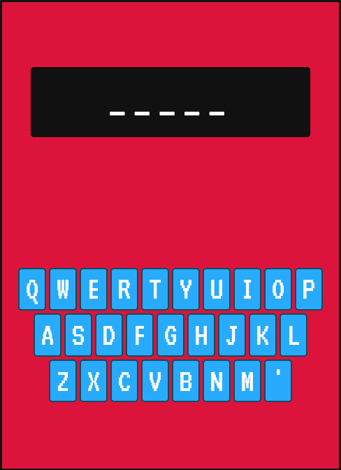
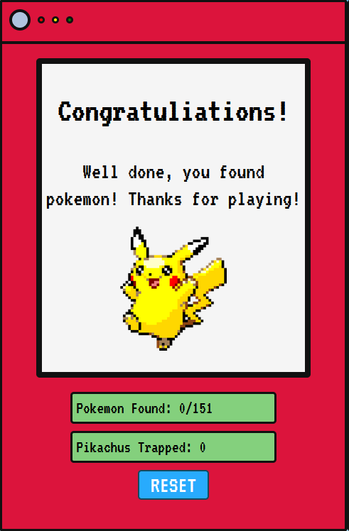
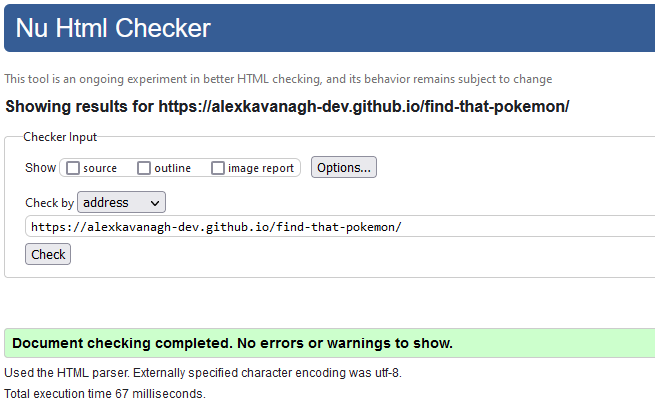
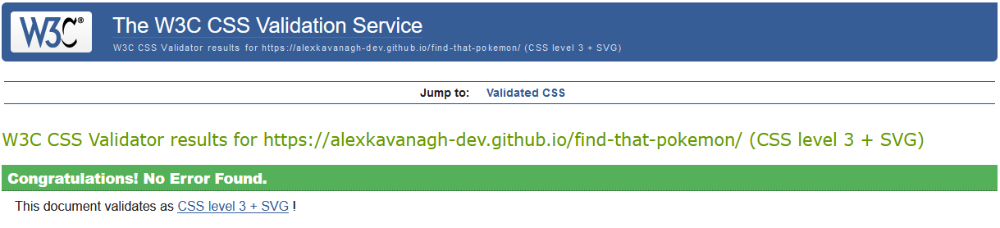
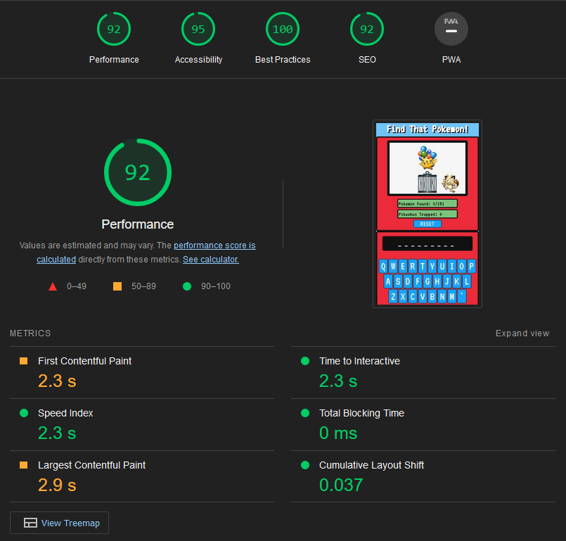

# Find That Pokemon!
Find That Pokemon! is a Pokemon themed game based on the classic word guessing game: Hangman. It shares the same core concepts as the original Hangman game with a few differences:

- Text, imagery and sound effects are all retro and Pokemon themed. 
- The words to be guessed are the original 151 Pokemon from the first generation.
- Rather than the original hangman drawing being done step by step when an incorrect letter is guessed, there is instead a Pikachu flying with seven balloons over a trap and each wrong letter pops a balloon until Pikachu falls to the trap and the game moves on to the next word. 
- When a word is fully guessed, the players score counter is incremented and the next word is chosen after a short delay.
- There is an overall goal to try find as many Pokemon as you can. The Pokemon do not repeat so each time Pikachu falls to the trap, that Pokemon has been lost until the game is reset. 

The other core concepts of hangman remain: 

- A word to be guessed is shown blanked out with dashes in place of letters and the player must guess letter by letter to find the full word. 
- If a letter is guessed correctly, the dash(es) representing that letter in the answer are replaced with the letter and a positive ping sound is played. 
- If a letter is guessed incorrectly, one the players lives (represented by the balloons holding up Pikachu) is lost and a balloon pops with a sound effect. 
- When all the players lives are lost Pikachu will fall into the trap and then a new word is picked similar to how Hangman works. 

As above, the main aim of the game is to find as many Pokemon as you can of the 151 and at the end there is a screen to congratulate the player on finishing and how many they found. 

Pokemon and all related content are created/owned/copyright of The Pokemon Company/Nintendo/Gamefreak for which I do not take any credit or for the imagery and audio used. The credit section below will show where the images and audio used were taken from. The Pokemon theme was just a more interesting and fun way to make this project. 

[Link to the live project](https://github.com/alexkavanagh-dev/find-that-pokemon)

# Features
## Current Features

- Main Game Area
    - The main game area is front and center when the page loads and styled with CSS to resemble a Pokedex albeit a basic one.  
    - The title of the game is displayed above the game area/Pokedex in the same pixelated font as the rest of the page.
    - There is a left and right panel to the Pokedex which contain the core interactive parts of the game and are split by a center hinge.
    - The background image is a retro styled picture overlooking the ocean, based on the introduction cinematic from Pokemon Emerald. (Credit to the artist in the credit section)

- Left Panel
    - Contains a large screen for feedback during the game, two smaller screens showing the users current scores and a reset button. 
    - The large screen displays Pikachu floating with balloons above a trap set by Meowth and reacts to input from the user.
    - The two smaller score screens display the scores for amount of Pokemon found and times Pikachu has been trapped on retro styled green screens with pixelated black text.
    - The reset button is styled similar to the other buttons in the game and resemble buttons from a Pokedex. When it is clicked the game resets back to the beginning and useful if the player would like to try again at the end of the game or reset during the game to try get a better score. 

- Right Panel
    - Contains a medium sized screen that displays the answer in the top half and a keyboard for input in the bottom half. 
	- The answer screen is a simple black screen with white text that begins with showing the answer in dashes and will fill out letters accordingly as correct letters are guessed.
	- The keyboard is a qwerty style keyboard with blue keys and white letters. I chose a qwerty layout over listing letters alphabetically as the alphabet couldn't be divided evenly into 3 or 4 rows to fit where it needed to. Qwerty doesn't divide evenly either but is a layout that people are used to and fitted neatly. 
	- When the user clicks on a letter, that letter is disabled and blanked out then checked against the answer. The game will react accordingly whether that letter was correct or incorrect.
	- The keyboard is reset each time either the reset button is clicked, a Pokemon is found or all the players lives are lost.

- Game End Screen
	-  Replaces the large screen on the left panel when the game is finished to indicate to the player that the game is over.
	- Shows text to congratulate the player on how many Pokemon they found and thank them for playing.
	- Shows a happy looking Pikachu with arms in the air to reinforce the congratulations and thanks to the player. 

- Audio Feedback
    - There is audio feedback for clicking the reset button, clicking a correct letter or incorrect letter, finding a Pokemon and Pikachu falling.
    - All audio is 8bit to keep in theme with the other retro elements. 
	- The reset button audio is a simple button click sound since it is a neutral action and doesn't need to signify success or failure, just give the player feedback that the button was clicked. 
	- The correct letter audio is a short positive sounding ping since getting a letter correct is a success and this helps reinforce a positive feedback for the player. 
	- The incorrect letter audio is a short pop sound effect to represent the balloon popping from Pikachu and provide a small negative feedback without being too harsh. 
	- The audio played for finding a Pokemon is a more emphatic ping noise to elicit a stronger positive feeling from the player and signify that a point has been gained. 
	- The audio played when all the balloons have popped is a falling sound to represent Pikachu falling to the trap and provide a stronger negative feedback for the player. 

## Possible Future Features
- Allow user to select between different generations of Pokemon beyond just the first generation.
- Allow user to select multiple generations at once for a tougher challenge. 
- Allow the user to input letters from their physical keyboard in addition to clicking the virtual one. 
- An optional timer to allow another layer of challenge for the player.
- Save users progress locally to show them their high score from previous attempts.
- An online leaderboard showing submitted high scores and times if the the timer feature. 
- Briefly show an image on the large screen on the left panel of a Pokemon when it has been found.
- A hard mode where if Pikachu is trapped once, the user has to restart all over. 
- The lights in the top of the left panel could be used to provide more feedback such as lighting up on inputs or correct/incorrect answers.  

# Testing
## Validator Testing
- HTML
    - No errors were found when run through the [W3C MarkUp Validator](https://validator.w3.org/).

- CSS
    - No errors were found when run through the [W3C CSS Validator](https://jigsaw.w3.org/css-validator/).

- JavaScript
	- No major issues found when run through a linter. [JSHint](https://jshint.com/).
- Lighthouse
    - I confirmed through the lighthouse tester that the website has adequate performance and is sufficiently accessible.

## Compatibility Testing
- I checked that the website works as intended on different desktop browsers: Chrome, FireFox and Edge.
- I checked that the website works as intended on iPhone and several android phones with Chrome and Firefox. 

## Manual Testing
 I have intentionally left it in the JavaScript that when a new answer is picked it will log it out to the console to make testing easier for anyone unfamiliar with Pokemon. 

| Test Label             | Test Action                   | Expected Result                                                                                                                                                      | Test Outcome |
|------------------------|-------------------------------|----------------------------------------------------------------------------------------------------------------------------------------------------------------------|--------------|
| Reset Game             | Click reset button            | Player scores and lives reset back to zero, input keyboard reset, new answer picked and displayed in dashes.                                                         | PASS         |
| Input Letter           | Click letter on keyboard      | Selected letter is disabled, blanked out and checked against answer.                                                                                                 | PASS         |
| Correct Letter Input   | Input letter from answer      | Positive ping sound plays, appropriate dash in answer is replaced with the letter.                                                                                   | PASS         |
| Incorrect Letter Input | Input letter not from answer  | Balloon pop sound plays, player lives decrements/balloon on screen disappears.                                                                                       | PASS         |
| All Lives Lost         | Player has 7 incorrect inputs | Falling sound plays, image shows Pikachu in the trap cage, trapped score increments.  After 2 second delay, keyboard is reset, new answer is picked and displayed | PASS         |
| Full Answer Guessed    | Player has all letters found  | Positive ping sound plays, Pokemon found score increments.  After 1 second delay, keyboard is reset, new answer is picked and displayed.                          | PASS         |
| End of Game            | All answers have been used    | Input keyboard disables, win screen disables in place of the large screen on the left panel.                                                                         | PASS         |

## Responsive Testing
- I checked that the website is responsive, looks good and works well on different screen sizes from my own desktop monitor and for many tablets and phones as small as the iPhone 5 using responsive developer tools.
-  I double checked the same as above on an real phones to ensure proper responsiveness. 

## Fixed Bugs
- When the delay was added to the next Pokemon being picked, the keyboard was still active so the player could add inputs during that delay and still affect their lives left and scores. This was fixed by adding a function to disable the keyboard whenever the player doesn't need to input. 
- Similar to the above, the rest button could be used during these delays and cause issues. It was fixed the same way bu disabling it when the player doesn't need to input. 
- This wasn't really a bug but something I found interesting and tested. Instead of the current method of using a cloned array from the main Pokemon array to select a new answer and then remove that answer from the cloned array, I did try to use sets to keep track of the Pokemon already used but thought it might be inconsistent in how long an answer would be picked. Using sets, a random number was used to pick a Pokemon from the main array and checked against the Pokemon already used set before using it as the answer. If it was already in the set, a new Pokemon would be picked again at random and checked again. If it was not in the set, it would be added to the set and used as the next answer. Towards the end of the game this meant you would very likely have to retry many times to get a Pokemon that hadn't already been used so I did test this using performance.now() and a simple loop to get the average time of the last Pokemon being picked. After a few thousand iterations, the average time to pick the last Pokemon was around 3.5 milliseconds but could sometimes take nearly 1000 retries and 50 milliseconds so how long it takes was really up to chance and could take any amount of time. Realistically this doesn't matter for a project this size but if there was more Pokemon added or the game was part of a bigger site it could potentially be an issue as performance is depending luck. 

## Unfixed Bugs
- No unfixed bugs that I am aware of. 

# Deployment
The website is currently deployed to GitHub Pages.

The steps to deploy it were as follows: 
- Go to the repository that is to be deployed.
- In that repository, navigate to the settings page.
- In the sidebar of the settings page, open the Pages tab. 
- In the branch section, use the drop down menu to select which branch to deploy. For me, it was just the main branch. 
- Click the save button and shortly after you can refresh the page where a link will now show up to the deployed website.  

Once deployed to GitHub Pages, the website will automatically update with new changes when commits are made to the main branch.

This repository can be cloned by entering the command `git clone https://github.com/alexkavanagh-dev/find-that-pokemon.git` into the terminal of your chosen IDE.

The link for my website on GitHub Pages is here: https://alexkavanagh-dev.github.io/find-that-pokemon/

# Credits
## Content

- As in the introduction, Pokemon and all related content are created/owned/copyright of The Pokemon Company/Nintendo/Gamefreak for which I take no credit. 
- All images and sound effects were taken from different places on the internet and will be individually credited below. 

## Images

Some images were edited by myself such as the Flying Pikachu image, I duplicated some of the balloons so that there would be seven in total and the cage and Trapped Pikachu being combined for use in the project. 

Links for any images used here: 
- [Flying Pikachu](https://www.reddit.com/r/pokemongo/comments/i0yd33/recolour_of_the_classic_pokemon_yellow_balloon/)
- [Meowth](https://www.deviantart.com/nonhovoglia/art/Meowth-Pixel-Art-671366525)
- [Cage Trap](https://www.artstation.com/artwork/DAOeZn)
- [Background Image](https://www.reddit.com/r/wallpapers/comments/1tqe9k/update_new_version_of_the_8bit_day_wallpaper_set/)
- [Happy Pikachu](https://aminoapps.com/c/pokemon-amino-ptbr/page/blog/pixel-desenho-charmander-pikachu-alakasam-e-eevee/baYl_d4UouBzpjYGVpXqDLg433pve2a2oa)
- [Trapped Pikachu](https://www.deviantart.com/animegamerfreak/art/Pixel-Pikachu-304726012)
- [PokeBall Favicon](https://www.favicon.cc/?action=icon&file_id=883760)
- [Pixlr](https://pixlr.com/) was used to edit images.

## Audio
- [Balloon Pop](https://freesound.org/people/LittleRobotSoundFactory/sounds/270316/)
- [Button Click](https://freesound.org/people/EminYILDIRIM/sounds/536108/)
- [Correct Input Ping](https://freesound.org/people/LittleRobotSoundFactory/sounds/270304/)
- [Pokemon Found Ping](https://freesound.org/people/LittleRobotSoundFactory/sounds/270303/)
- [Pikachu Falling](https://freesound.org/people/MentosLat/sounds/417486/)
- [Audacity](https://www.audacityteam.org/) was used to trim some sounds slightly as they had some dead air at the end. 

## Code
- The font used on this website is the 'VT323' font imported from Google Fonts.
-  www.w3schools.com/ and https://developer.mozilla.org/en-US/ were great resources throughout this whole project. 
- The Pokemon array was copied from here: https://gist.github.com/octalmage/6936761
